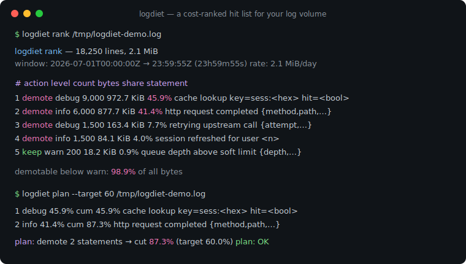
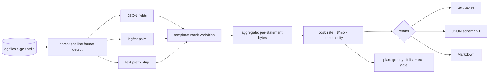

# logdiet

[English](README.md) | [中文](README.zh.md) | [日本語](README.ja.md)

[](LICENSE) [](go.mod) [](CHANGELOG.md)  [](CONTRIBUTING.md)

**logdiet：ログステートメントを行数とバイト量でランク付けし、降格した場合の節約額を見積もるオープンソース・依存ゼロの CLI——「ログ量を 40% 削れ」の裏付けとなる、コスト順の実行リスト。**



```bash
git clone https://github.com/JaydenCJ/logdiet && cd logdiet
go build -o logdiet ./cmd/logdiet    # single static binary, stdlib only
```

> プレリリース：v0.1.0 はまだパッケージレジストリに公開されていません。上記の手順でソースからビルドしてください（Go ≥1.22 なら何でも可）。

## なぜ logdiet？

オブザーバビリティの請求額が爆発し、誰かが「ログ量を 40% 削れ」と命じる——しかしチームには地図が渡されない。ベンダーの使用量ダッシュボードは間違った問いに答えている：表示されるのは*サービス*や*インデックス*ごとの量なのに、修正は常にコード内の個々の `log.Debug(…)` 呼び出しで起きるからだ。ログビューア（`lnav`、`angle-grinder`）は行の閲覧と検索のためのもので、コストの帰属には向かない。Drain3 のようなテンプレートマイナーはメッセージをクラスタリングするが、肝心の部分——どのステートメントを本番レベル未満に降格すべきか、それが月いくらの価値か——の手前で止まる。logdiet はあらゆるログファイル・ストリーム上でこのループ全体をオフラインで回す：JSON・logfmt・プレーンテキストを行ごとに検出し、可変トークンをマスクして数百万行を生成元のステートメントに畳み込み、バイト量でランク付けして取り込み単価から月額ドルを外挿し、終了コードでゲートできる貪欲な降格プランを出力する——目標達成に触るべきステートメントを正確に示して。

| | logdiet | ベンダー使用量ダッシュボード | lnav / angle-grinder | Drain3 |
|---|---|---|---|---|
| 量を個々のログステートメントに帰属 | ✅ | ❌ サービス/インデックス単位 | ❌ 行/クエリ単位 | ✅ テンプレート |
| 月額ドル見積もり付きの降格提案 | ✅ | ❌ | ❌ | ❌ |
| 削減目標への貪欲プラン＋終了コードゲート | ✅ | ❌ | ❌ | ❌ |
| 同一ストリームで JSON + logfmt + テキスト混在 | ✅ | 対象外 | 一部 | ❌ 生テキストのみ |
| ファイル・.gz・stdin をオフライン処理 | ✅ | ❌ SaaS | ✅ | ✅ ライブラリ |
| ランタイム依存 | 0 | 対象外 | C++ 依存 / Rust crates | Python + 依存 |

<sub>依存数は 2026-07-13 に確認：logdiet は Go 標準ライブラリのみ。Drain3 は PyPI から 3+ のランタイムパッケージを取得。</sub>

## 特長

- **ステートメント単位の帰属** — 順序付きマスク規則（タイムスタンプ、UUID、IP、16 進 ID、所要時間、サイズ、引用文字列、パスセグメント、数値）が数百万の描画済み行を生成元の `log.X(…)` 呼び出しに畳み込む。マスクは構造上もテスト上も冪等。
- **メガバイトではなくお金で** — 観測された時間窓を日次バイト量に外挿し、`--price`（GB 単価）でステートメントごとの月額ドルを算出。タイムスタンプがなければ正直にバイト比率へ縮退。
- **レポートではなくプランを** — `logdiet plan --target 40` は `--keep` 未満のステートメントだけで目標に届く最小の貪欲リストを累積割合付きで返し、`--strict` の終了コードで予算チェックをゲートする。
- **ログをあるがままに受け入れる** — JSON・logfmt・接頭辞付きテキストの行ごと検出。各エコシステムのレベル表記（pino の数値 10–60 含む）に対応し、Java/Python の `logger - message` を抽出。`--level-key`/`--msg-key`/`--time-key` でフィールド名を指定可能。
- **正直な帳簿** — すべての入力バイトはステートメントか有界のオーバーフローバケット（既定上限 100,000 テンプレート）に着地。レベル不明の行は決して降格提案されず、同一入力はバイト単位で同一のレポートを生む。
- **3 つの出力形式** — 人が読む端末テーブル、スクリプト向けの安定 JSON（`schema_version: 1`）、整理チケットにそのまま貼れる Markdown。
- **依存ゼロ・完全オフライン** — Go 標準ライブラリのみ。指定されたファイル以外には一切触れない。テレメトリもネットワークも、永遠になし。

## クイックスタート

```bash
# fabricate a deterministic 18,250-line demo log (one day of mixed traffic)
bash examples/make-demo-log.sh /tmp/logdiet-demo.log
./logdiet rank /tmp/logdiet-demo.log
```

実際にキャプチャした出力：

```text
logdiet rank — 18,250 lines, 2.1 MiB across /tmp/logdiet-demo.log
window: 2026-07-01T00:00:00Z → 2026-07-01T23:59:55Z (23h59m55s)
rate:   2.1 MiB/day  →  est $0.03/mo at $0.50/GB ingested

by level       lines        bytes    share
  debug       10,500      1.1 MiB    53.6%
  info         7,500    961.9 KiB    45.4%
  warn           200     18.2 KiB     0.9%
  error           50      4.6 KiB     0.2%

top 6 of 6 statements by bytes
   #  action level       count       bytes   share      $/mo  statement
   1  demote debug       9,000   972.7 KiB   45.9%     $0.01  cache lookup key=sess:<hex> hit=<bool> {shard}
   2  demote info        6,000   877.7 KiB   41.4%     $0.01  http request completed {dur_ms,method,path,status}
   3  demote debug       1,500   163.4 KiB    7.7%     $0.00  retrying upstream call {attempt,backoff,target}
   4  demote info        1,500    84.1 KiB    4.0%     $0.00  session refreshed for user <n>
   5  keep   warn          200    18.2 KiB    0.9%     $0.00  queue depth above soft limit {depth,queue}
   6  keep   error          50     4.6 KiB    0.2%     $0.00  com.example.Billing — charge failed for user <n>: card declined

demotable below warn: 98.9% of all bytes — `logdiet plan --target N` builds the hit list
```

ランキングを実行可能なリストに変える（`./logdiet plan --target 60 /tmp/logdiet-demo.log` の実出力）：

```text
logdiet plan — cut 60.0% of log bytes by demoting statements below warn
input: 18,250 lines, 2.1 MiB; demotable ceiling: 98.9% of bytes

   1  debug     45.9%  cum  45.9%    972.7 KiB      $0.01/mo  cache lookup key=sess:<hex> hit=<bool> {shard}
   2  info      41.4%  cum  87.3%    877.7 KiB      $0.01/mo  http request completed {dur_ms,method,path,status}

plan: demote 2 statements → cut 87.3% (target 60.0%), est $0.03/mo saved
plan: OK
```

デモは意図的に小さくしてある。本番ログ丸一日分に向けて（`.gz` も `kubectl logs … | logdiet rank -` も可）、契約上の `--price` を渡せば、引用に値する数字が得られる。

## CLI リファレンス

`logdiet [rank|plan|version] [flags] [file…]` — 既定は `rank`。`-` またはファイル省略で stdin を読む。終了コード：0 正常、1 `plan --strict` 未達、2 使用法エラー、3 実行時エラー。

| フラグ | 既定値 | 効果 |
|---|---|---|
| `--format` | `text` | `text`・`json`。`rank` は `markdown` も受け付ける |
| `--keep` | `warn` | 本番で残す最低レベル。厳密にこれ未満のステートメントが降格候補 |
| `--price` | `0.50` | 金額見積もりに使う取り込み単価（USD/GB） |
| `--top`（rank） | `20` | 表示するステートメント数。`0` = 全部 |
| `--by`（rank） | `bytes` | ランクキー：`bytes` か `count` |
| `--target`（plan） | `40` | バイト削減目標（パーセント） |
| `--strict`（plan） | オフ | 降格だけで目標に届かない場合に終了コード 1 |
| `--level-key` / `--msg-key` / `--time-key` | — | 構造化ログの追加フィールド名（繰り返し可） |
| `--max-statements` | `100000` | メモリに保持する異なるテンプレートの上限。あふれは必ず報告され、黙って捨てられない |

行がステートメントになる仕組み——マスク規則表、同一性の規則、正直な制限リスト——は [docs/templating.md](docs/templating.md) に記載。

## 検証

このリポジトリは CI を同梱しない。上記の主張はすべてローカル実行で検証される：

```bash
go test ./...            # 90 deterministic tests, offline, < 5 s
bash scripts/smoke.sh    # end-to-end CLI check, prints SMOKE OK
```

## アーキテクチャ



## ロードマップ

- [x] v0.1.0 — 行ごとの JSON/logfmt/テキスト検出、冪等なテンプレートマスク、バイト/行数ランキングと月額換算、`--strict` ゲート付き貪欲降格プラン、90 テスト + スモークスクリプト
- [ ] ソーススキャン：テンプレートをリポジトリ内の `log.X(…)` 呼び出し位置に対応付けて file:line を出力
- [ ] サンプリングアドバイザ：請求を支配する保持ステートメントに `1:N` サンプル率を提案
- [ ] キー別ペイロード分析：どの*フィールド*（スタックトレース、構造体ダンプ）がバイトを食っているか
- [ ] IPv6 と設定可能なカスタムマスク規則
- [ ] ストリーミングモード：`tail -f` パイプライン向けの定期スナップショット

全リストは [open issues](https://github.com/JaydenCJ/logdiet/issues) を参照。

## コントリビュート

Issue・ディスカッション・PR を歓迎——ローカルワークフロー（フォーマット、vet、テスト、`SMOKE OK`）は [CONTRIBUTING.md](CONTRIBUTING.md) を参照。入門タスクは [good first issue](https://github.com/JaydenCJ/logdiet/issues?q=is%3Aissue+is%3Aopen+label%3A%22good+first+issue%22) のラベル付き。設計の議論は [Discussions](https://github.com/JaydenCJ/logdiet/discussions) で。

## ライセンス

[MIT](LICENSE)
