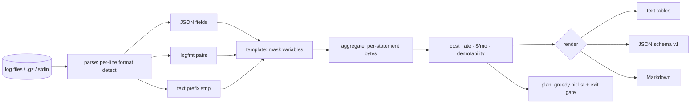

# logdiet

[English](README.md) | [中文](README.zh.md) | [日本語](README.ja.md)

[](LICENSE) [](go.mod) [](CHANGELOG.md)  [](CONTRIBUTING.md)

**logdiet：an open-source, zero-dependency CLI that ranks log statements by volume and bytes and estimates the savings from demoting them — the cost-ranked hit list behind "cut our log volume 40%".**


```bash
git clone https://github.com/JaydenCJ/logdiet && cd logdiet
go build -o logdiet ./cmd/logdiet    # single static binary, stdlib only
```

> Pre-release: v0.1.0 is not tagged on a package registry yet; build from source as above (any Go ≥1.22).

## Why logdiet?

Observability bills are exploding, so someone eventually decrees "cut log volume 40%" — and hands the team no map. Vendor usage dashboards answer the wrong question: they show volume per *service* or per *index*, when the fix always happens at an individual `log.Debug(…)` call in code. Log explorers (`lnav`, `angle-grinder`) are built for reading and querying lines, not for attributing spend; template miners like Drain3 cluster messages but stop before the part that matters — which statements to demote below your production level and what that is worth per month. logdiet does the whole loop offline on any log file or stream: it detects JSON, logfmt, and plain-text lines individually, masks the variable tokens so millions of lines fold back into the statements that produced them, ranks those statements by bytes with an extrapolated $/month at your ingest price, and emits a greedy demotion plan — with an exit-code gate — that tells you exactly which statements to touch to hit the target.

| | logdiet | vendor usage dashboards | lnav / angle-grinder | Drain3 |
|---|---|---|---|---|
| Attributes volume to individual log statements | ✅ | ❌ per service/index | ❌ per line/query | ✅ templates |
| Demotion suggestions with $/month estimates | ✅ | ❌ | ❌ | ❌ |
| Greedy plan to a reduction target, exit-code gated | ✅ | ❌ | ❌ | ❌ |
| Mixed JSON + logfmt + plain text in one stream | ✅ | n/a | partial | ❌ raw text only |
| Works offline on files, .gz, stdin | ✅ | ❌ SaaS | ✅ | ✅ library |
| Runtime dependencies | 0 | n/a | C++ deps / Rust crates | Python + deps |

<sub>Dependency counts checked 2026-07-13: logdiet imports the Go standard library only; Drain3 pulls 3+ runtime packages from PyPI.</sub>

## Features

- **Statement-level attribution** — ordered masking rules (timestamps, UUIDs, IPs, hex IDs, durations, sizes, quoted strings, path segments, numbers) fold millions of rendered lines back into the `log.X(…)` calls that produced them; masking is idempotent by construction and by test.
- **Money, not just megabytes** — the observed time window extrapolates to bytes/day and, at your `--price` per GB, a $/month figure per statement; without timestamps it degrades honestly to byte shares.
- **A plan, not a report** — `logdiet plan --target 40` returns the smallest greedy hit list of below-`--keep` statements that reaches the target, with cumulative percentages and `--strict` exit-code gating for budget checks.
- **Meets logs as they are** — per-line detection of JSON, logfmt, and prefixed plain text; level spellings across ecosystems (including pino's numeric 10–60); Java/Python `logger - message` extraction; custom field names via `--level-key`/`--msg-key`/`--time-key`.
- **Honest accounting** — every input byte lands on a statement or the bounded overflow bucket (default cap 100,000 templates), unknown-level lines are never suggested for demotion, and identical inputs produce byte-identical reports.
- **Three output formats** — terminal tables for humans, stable JSON (`schema_version: 1`) for scripts, PR-ready Markdown for the cleanup ticket.
- **Zero dependencies, fully offline** — Go standard library only; reads the files you point it at and nothing else. No telemetry, no network, ever.

## Quickstart

```bash
# fabricate a deterministic 18,250-line demo log (one day of mixed traffic)
bash examples/make-demo-log.sh /tmp/logdiet-demo.log
./logdiet rank /tmp/logdiet-demo.log
```

Real captured output:

```text
logdiet rank — 18,250 lines, 2.1 MiB across /tmp/logdiet-demo.log
window: 2026-07-01T00:00:00Z → 2026-07-01T23:59:55Z (23h59m55s)
rate:   2.1 MiB/day  →  est $0.03/mo at $0.50/GB ingested

by level       lines        bytes    share
  debug       10,500      1.1 MiB    53.6%
  info         7,500    961.9 KiB    45.4%
  warn           200     18.2 KiB     0.9%
  error           50      4.6 KiB     0.2%

top 6 of 6 statements by bytes
   #  action level       count       bytes   share      $/mo  statement
   1  demote debug       9,000   972.7 KiB   45.9%     $0.01  cache lookup key=sess:<hex> hit=<bool> {shard}
   2  demote info        6,000   877.7 KiB   41.4%     $0.01  http request completed {dur_ms,method,path,status}
   3  demote debug       1,500   163.4 KiB    7.7%     $0.00  retrying upstream call {attempt,backoff,target}
   4  demote info        1,500    84.1 KiB    4.0%     $0.00  session refreshed for user <n>
   5  keep   warn          200    18.2 KiB    0.9%     $0.00  queue depth above soft limit {depth,queue}
   6  keep   error          50     4.6 KiB    0.2%     $0.00  com.example.Billing — charge failed for user <n>: card declined

demotable below warn: 98.9% of all bytes — `logdiet plan --target N` builds the hit list
```

Turn the ranking into an actionable hit list (real output of `./logdiet plan --target 60 /tmp/logdiet-demo.log`):

```text
logdiet plan — cut 60.0% of log bytes by demoting statements below warn
input: 18,250 lines, 2.1 MiB; demotable ceiling: 98.9% of bytes

   1  debug     45.9%  cum  45.9%    972.7 KiB      $0.01/mo  cache lookup key=sess:<hex> hit=<bool> {shard}
   2  info      41.4%  cum  87.3%    877.7 KiB      $0.01/mo  http request completed {dur_ms,method,path,status}

plan: demote 2 statements → cut 87.3% (target 60.0%), est $0.03/mo saved
plan: OK
```

The demo is deliberately small; point it at a real day of production logs (`.gz` is fine, so is `kubectl logs … | logdiet rank -`) and pass your contract `--price` for numbers worth quoting.

## CLI reference

`logdiet [rank|plan|version] [flags] [file…]` — `rank` is the default; `-` or no file reads stdin. Exit codes: 0 ok, 1 `plan --strict` shortfall, 2 usage error, 3 runtime error.

| Flag | Default | Effect |
|---|---|---|
| `--format` | `text` | `text`, `json`; `rank` also accepts `markdown` |
| `--keep` | `warn` | lowest level kept in production; statements strictly below it are demotable |
| `--price` | `0.50` | ingest price in USD per GB for the $ estimates |
| `--top` (rank) | `20` | statements to show, `0` = all |
| `--by` (rank) | `bytes` | ranking key: `bytes` or `count` |
| `--target` (plan) | `40` | byte-reduction target in percent |
| `--strict` (plan) | off | exit 1 when demotion alone cannot reach the target |
| `--level-key` / `--msg-key` / `--time-key` | — | extra field names for structured logs (repeatable) |
| `--max-statements` | `100000` | cap on distinct templates held in memory; overflow is reported, never dropped silently |

How lines become statements — the masking table, identity rules, and the honest list of limitations — is documented in [docs/templating.md](docs/templating.md).

## Verification

This repository ships no CI; every claim above is verified by local runs:

```bash
go test ./...            # 90 deterministic tests, offline, < 5 s
bash scripts/smoke.sh    # end-to-end CLI check, prints SMOKE OK
```

## Architecture



## Roadmap

- [x] v0.1.0 — per-line JSON/logfmt/text detection, idempotent template masking, byte/count ranking with $/month, greedy demotion plans with `--strict` gating, 90 tests + smoke script
- [ ] Source scanning: match templates to `log.X(…)` call sites in a repo and emit file:line
- [ ] Sampling advisor: suggest `1:N` sample rates for kept statements that dominate the bill
- [ ] Per-key payload analysis: which *fields* (stack traces, dumped structs) carry the bytes
- [ ] IPv6 and configurable custom masking rules
- [ ] Streaming mode with periodic snapshots for `tail -f` pipelines

See the [open issues](https://github.com/JaydenCJ/logdiet/issues) for the full list.

## Contributing

Issues, discussions and pull requests are welcome — see [CONTRIBUTING.md](CONTRIBUTING.md) for the local workflow (format, vet, tests, `SMOKE OK`). Good entry points are labelled [good first issue](https://github.com/JaydenCJ/logdiet/issues?q=is%3Aissue+is%3Aopen+label%3A%22good+first+issue%22), and design questions live in [Discussions](https://github.com/JaydenCJ/logdiet/discussions).

## License

[MIT](LICENSE)
