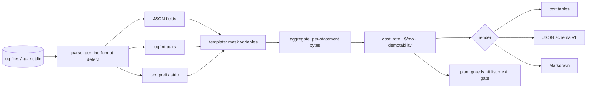

# logdiet

[English](README.md) | [中文](README.zh.md) | [日本語](README.ja.md)

[](LICENSE) [](go.mod) [](CHANGELOG.md)  [](CONTRIBUTING.md)

**logdiet：开源、零依赖的 CLI，按行数与字节量给日志语句排名，并估算把它们降级后能省下多少钱——"日志量砍 40%" 背后那份按成本排序的行动清单。**


```bash
git clone https://github.com/JaydenCJ/logdiet && cd logdiet
go build -o logdiet ./cmd/logdiet    # single static binary, stdlib only
```

> 预发布：v0.1.0 尚未发布到任何包仓库；请按上述方式从源码构建（任意 Go ≥1.22）。

## 为什么选 logdiet？

可观测性账单正在爆炸，于是总有人下令"日志量砍 40%"——却不给团队任何地图。厂商用量仪表盘回答的是错误的问题：它们按*服务*或*索引*展示体量，而真正的修复永远发生在代码里某一个 `log.Debug(…)` 调用上。日志浏览器（`lnav`、`angle-grinder`）为阅读和查询行而生，不为归因开销；Drain3 这类模板挖掘器能聚类消息，却止步于最关键的部分——哪些语句该降到生产级别以下、每月值多少钱。logdiet 在任意日志文件或流上离线完成整个闭环：逐行识别 JSON、logfmt 和纯文本，掩码变量 token 让数百万行折叠回产生它们的语句，按字节给语句排名并按你的接入单价外推出每月美元数，最后输出一份带退出码门禁的贪心降级计划——精确告诉你要动哪些语句才能达标。

| | logdiet | 厂商用量仪表盘 | lnav / angle-grinder | Drain3 |
|---|---|---|---|---|
| 把体量归因到单条日志语句 | ✅ | ❌ 按服务/索引 | ❌ 按行/查询 | ✅ 模板 |
| 带每月美元估算的降级建议 | ✅ | ❌ | ❌ | ❌ |
| 面向削减目标的贪心计划＋退出码门禁 | ✅ | ❌ | ❌ | ❌ |
| 同一流里混合 JSON + logfmt + 纯文本 | ✅ | 不适用 | 部分 | ❌ 仅原始文本 |
| 离线处理文件、.gz、stdin | ✅ | ❌ SaaS | ✅ | ✅ 库 |
| 运行时依赖 | 0 | 不适用 | C++ 依赖 / Rust crates | Python + 依赖 |

<sub>依赖数核对于 2026-07-13：logdiet 只引用 Go 标准库；Drain3 从 PyPI 拉取 3+ 个运行时包。</sub>

## 功能

- **语句级归因** — 有序掩码规则（时间戳、UUID、IP、十六进制 ID、时长、大小、引号字符串、路径段、数字）把数百万条渲染后的行折叠回产生它们的 `log.X(…)` 调用；掩码在构造上和测试上都是幂等的。
- **算钱，不止算兆字节** — 观测到的时间窗外推为每日字节量，再按你的 `--price`（每 GB）得出每条语句的每月美元数；没有时间戳时诚实退化为字节占比。
- **给计划，不止给报告** — `logdiet plan --target 40` 返回能达标的最小贪心清单（只含 `--keep` 以下的语句），附累计百分比，并用 `--strict` 退出码为预算检查设门禁。
- **按日志的本来面目接纳它们** — 逐行识别 JSON、logfmt、带前缀的纯文本；覆盖各生态的级别拼写（含 pino 的数字 10–60）；提取 Java/Python 的 `logger - message`；用 `--level-key`/`--msg-key`/`--time-key` 指定自定义字段名。
- **诚实的记账** — 每个输入字节都落在某条语句或有界溢出桶上（默认上限 100,000 个模板），级别未知的行绝不会被建议降级，相同输入产生逐字节相同的报告。
- **三种输出格式** — 给人看的终端表格、给脚本用的稳定 JSON（`schema_version: 1`）、可直接贴进清理工单的 Markdown。
- **零依赖、完全离线** — 只用 Go 标准库；只读你指定的文件，别的一概不碰。永远没有遥测、没有网络。

## 快速上手

```bash
# fabricate a deterministic 18,250-line demo log (one day of mixed traffic)
bash examples/make-demo-log.sh /tmp/logdiet-demo.log
./logdiet rank /tmp/logdiet-demo.log
```

真实捕获的输出：

```text
logdiet rank — 18,250 lines, 2.1 MiB across /tmp/logdiet-demo.log
window: 2026-07-01T00:00:00Z → 2026-07-01T23:59:55Z (23h59m55s)
rate:   2.1 MiB/day  →  est $0.03/mo at $0.50/GB ingested

by level       lines        bytes    share
  debug       10,500      1.1 MiB    53.6%
  info         7,500    961.9 KiB    45.4%
  warn           200     18.2 KiB     0.9%
  error           50      4.6 KiB     0.2%

top 6 of 6 statements by bytes
   #  action level       count       bytes   share      $/mo  statement
   1  demote debug       9,000   972.7 KiB   45.9%     $0.01  cache lookup key=sess:<hex> hit=<bool> {shard}
   2  demote info        6,000   877.7 KiB   41.4%     $0.01  http request completed {dur_ms,method,path,status}
   3  demote debug       1,500   163.4 KiB    7.7%     $0.00  retrying upstream call {attempt,backoff,target}
   4  demote info        1,500    84.1 KiB    4.0%     $0.00  session refreshed for user <n>
   5  keep   warn          200    18.2 KiB    0.9%     $0.00  queue depth above soft limit {depth,queue}
   6  keep   error          50     4.6 KiB    0.2%     $0.00  com.example.Billing — charge failed for user <n>: card declined

demotable below warn: 98.9% of all bytes — `logdiet plan --target N` builds the hit list
```

把排名变成可执行的行动清单（`./logdiet plan --target 60 /tmp/logdiet-demo.log` 的真实输出）：

```text
logdiet plan — cut 60.0% of log bytes by demoting statements below warn
input: 18,250 lines, 2.1 MiB; demotable ceiling: 98.9% of bytes

   1  debug     45.9%  cum  45.9%    972.7 KiB      $0.01/mo  cache lookup key=sess:<hex> hit=<bool> {shard}
   2  info      41.4%  cum  87.3%    877.7 KiB      $0.01/mo  http request completed {dur_ms,method,path,status}

plan: demote 2 statements → cut 87.3% (target 60.0%), est $0.03/mo saved
plan: OK
```

演示日志刻意做得很小；把它对准一整天的生产日志（`.gz` 没问题，`kubectl logs … | logdiet rank -` 也行），并传入你的合同 `--price`，得到的数字才值得引用。

## CLI 参考

`logdiet [rank|plan|version] [flags] [file…]` — `rank` 为默认子命令；`-` 或不给文件则读 stdin。退出码：0 正常，1 `plan --strict` 未达标，2 用法错误，3 运行时错误。

| 标志 | 默认值 | 作用 |
|---|---|---|
| `--format` | `text` | `text`、`json`；`rank` 还接受 `markdown` |
| `--keep` | `warn` | 生产环境保留的最低级别；严格低于它的语句可降级 |
| `--price` | `0.50` | 美元/GB 的接入单价，用于金额估算 |
| `--top`（rank） | `20` | 展示的语句数，`0` = 全部 |
| `--by`（rank） | `bytes` | 排名键：`bytes` 或 `count` |
| `--target`（plan） | `40` | 字节削减目标（百分比） |
| `--strict`（plan） | 关 | 仅靠降级无法达标时以退出码 1 结束 |
| `--level-key` / `--msg-key` / `--time-key` | — | 结构化日志的额外字段名（可重复） |
| `--max-statements` | `100000` | 内存中不同模板的上限；溢出会明确报告，绝不静默丢弃 |

行如何变成语句——掩码规则表、身份规则以及诚实的局限清单——见 [docs/templating.md](docs/templating.md)。

## 验证

本仓库不带 CI；上面的每一条声明都由本地运行验证：

```bash
go test ./...            # 90 deterministic tests, offline, < 5 s
bash scripts/smoke.sh    # end-to-end CLI check, prints SMOKE OK
```

## 架构



## 路线图

- [x] v0.1.0 — 逐行 JSON/logfmt/文本识别、幂等模板掩码、按字节/行数排名并折算每月美元、带 `--strict` 门禁的贪心降级计划、90 个测试 + 冒烟脚本
- [ ] 源码扫描：把模板匹配到仓库里的 `log.X(…)` 调用点并输出 file:line
- [ ] 采样顾问：为主导账单的保留语句建议 `1:N` 采样率
- [ ] 按键的载荷分析：哪些*字段*（堆栈、整只结构体）在吃字节
- [ ] IPv6 与可配置的自定义掩码规则
- [ ] 流式模式：为 `tail -f` 管道定期输出快照

完整列表见 [open issues](https://github.com/JaydenCJ/logdiet/issues)。

## 参与贡献

欢迎 issue、讨论与 PR——本地工作流（格式化、vet、测试、`SMOKE OK`）见 [CONTRIBUTING.md](CONTRIBUTING.md)。入门任务标注为 [good first issue](https://github.com/JaydenCJ/logdiet/issues?q=is%3Aissue+is%3Aopen+label%3A%22good+first+issue%22)，设计讨论在 [Discussions](https://github.com/JaydenCJ/logdiet/discussions)。

## 许可证

[MIT](LICENSE)
